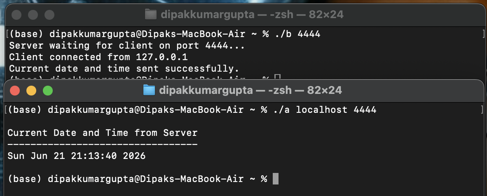

# Lab 1: TCP Client-Server Program to Display Current Date and Time

## Objective

* To understand the fundamentals of TCP socket programming.
* To establish communication between a TCP client and server.
* To send the current date and time from the server to the client.
* To learn the use of POSIX socket system calls.

---

## Theory

TCP (Transmission Control Protocol) is a connection-oriented communication protocol that ensures reliable, ordered, and error-free data transmission between a client and a server.

In this experiment, the server creates a TCP socket, binds it to a specified port, and listens for incoming client connections. After accepting a client connection, the server retrieves the current system date and time using the C Standard Library (`time.h`) and sends it to the connected client. The client receives the message and displays the current date and time on the terminal.

---

## System Calls Used

| Function    | Description                                        |
| ----------- | -------------------------------------------------- |
| `socket()`  | Creates a TCP socket.                              |
| `bind()`    | Binds the socket to an IP address and port number. |
| `listen()`  | Listens for incoming client connection requests.   |
| `accept()`  | Accepts a client connection request.               |
| `connect()` | Establishes a connection with the server.          |
| `read()`    | Receives data from the server.                     |
| `write()`   | Sends data to the client.                          |
| `close()`   | Closes the socket connection.                      |

---

## Compilation

Compile the server and client programs using GCC.

```bash
gcc server.c -o server
gcc client.c -o client
```

---

## Execution

### Start the Server

```bash
./server 5000
```

### Start the Client

Open another terminal and run:

```bash
./client 127.0.0.1 5000
```

---

## Sample Output

### Server

```text
Server waiting for client connection...
Client connected successfully.
Current date and time sent to client.
```

### Client

```text
Connected to server.

Current Date and Time:

Sun Jun 20 10:35:48 2026
```

---

## Output Screenshot



---

## Learning Outcomes

* Understood the TCP client-server communication model.
* Learned how to create and manage TCP sockets using the POSIX Socket API.
* Implemented reliable communication between a server and a client.
* Practiced socket programming and data transmission in C on Linux.
* Gained hands-on experience with network programming fundamentals.

---

## Conclusion

This experiment successfully demonstrated TCP client-server communication using the POSIX Socket API. The server accepted a client connection, obtained the current system date and time, and transmitted it to the client. The experiment provided practical experience with socket creation, connection establishment, data transmission, and connection termination in Linux using the C programming language.
